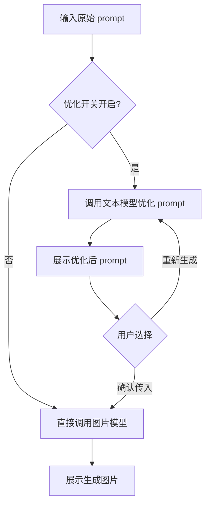

## 1. 产品概述

see-u-say 是一个部署在 Cloudflare Pages 上的 Text-to-Image 测试站，用于测试提示词（prompt）对 FLUX.2 klein 4B 模型的生成效果。支持最多 4 张参考图上传、自定义输出尺寸、以及可选的文本模型提示词优化。
- 目标用户：需要调试和验证文生图提示词效果的开发者
- 核心价值：在简洁界面中快速迭代 prompt，对比参考图与生成结果

## 2. 核心功能

### 2.2 功能模块
1. **主页面**：提示词输入、参考图上传、输出尺寸配置、生成按钮、结果展示、提示词优化开关

### 2.3 页面详情
| 页面名称 | 模块名称 | 功能描述 |
|-----------|-------------|---------------------|
| 主页面 | 主题切换 | 亮色/暗色/自动跟随系统三种模式手动切换 |
| 主页面 | 提示词输入 | 文本域输入原始 prompt |
| 主页面 | 参考图上传 | 最多 4 张，自动缩放至 ≤512×512 保持宽高比，支持 PNG/JPEG/WebP |
| 主页面 | 输出尺寸 | 宽高输入，校验 256-1920 且为 64 的倍数，默认 1024×768 |
| 主页面 | 提示词优化开关 | 默认关闭；开启后可选提供商/模型、设置优化规则、思考模式、温度、top_p、max_tokens |
| 主页面 | 优化结果区 | 展示优化后 prompt，可重新生成或确认传入图片模型 |
| 主页面 | 结果展示 | base64 解码为图片直接展示，保留原始尺寸 |

## 3. 核心流程

主流程：用户输入 prompt →（可选）开启优化：调用文本模型优化 → 展示优化结果 → 用户确认/重试 → 调用图片模型生成 → 前端展示图片。

## 4. 用户界面设计

### 4.1 设计风格
- 风格：极简、干净、技术工具感；深浅双色系，强调专注与留白
- 主色：深色模式以近黑底 + 单一冷色强调色；亮色模式以暖白底 + 同色系强调色
- 字体：标题用一款有辨识度的等宽或几何字体，正文用精致无衬线字体
- 布局：单列居中，卡片式分区（输入区 / 优化区 / 结果区），桌面优先，移动自适应
- 图标：极简线性 SVG

### 4.2 页面设计概览
| 页面名称 | 模块名称 | UI 元素 |
|-----------|-------------|-------------|
| 主页面 | 顶栏 | 站点名 + 主题切换三态按钮 |
| 主页面 | 输入卡 | 提示词文本域、参考图上传槽位、尺寸输入、生成按钮 |
| 主页面 | 优化卡 | 开关、提供商/模型下拉、参数面板、优化结果展示与操作按钮 |
| 主页面 | 结果卡 | 生成图片展示、加载态、错误态 |

### 4.3 响应式
桌面优先单列布局，移动端自适应收缩，参考图槽位换行，触控优化。

## 5. 约束与确认事项
- 提示词优化开关默认关闭
- API Token 不暴露给前端，由 Pages Functions 代理
- 图片模型固定 4 步推理，不可调
- 文本模型思考模式同时冗余传入 `thinking` 与 `enable_thinking` 两套字段
