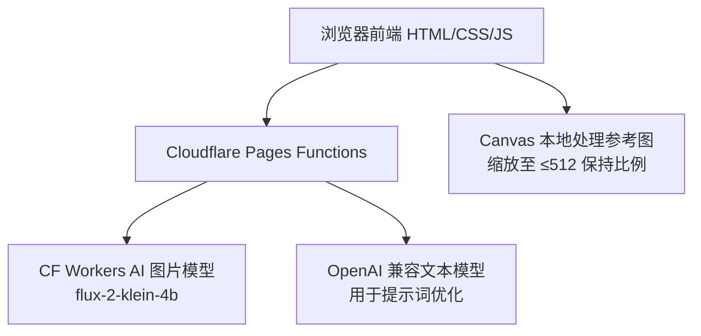

## 1. 架构设计



前端纯静态站点 + Pages Functions 作为后端代理（隐藏 CF API Token 与文本模型密钥）。

## 2. 技术说明
- 前端：原生 HTML/CSS/JS（无框架，符合"简约"要求与 Pages 静态托管）
- 后端：Cloudflare Pages Functions（`functions/api/*.js`，运行在边缘）
- 图片模型：`@cf/black-forest-labs/flux-2-klein-4b`，multipart/form-data 调用，输出 `{"image":"<base64>"}`
- 文本模型：OpenAI 兼容 `/chat/completions`，冗余传入 `thinking` + `enable_thinking`
- 主题：CSS 变量 + `data-theme` 属性 + `prefers-color-scheme` 媒体查询

## 3. 路由定义
| 路由 | 用途 |
|-------|---------|
| `/` | 主页面（静态 HTML） |
| `/api/generate` | 代理调用图片模型（接收 prompt、width、height、参考图） |
| `/api/optimize` | 代理调用文本模型优化提示词 |
| `/api/providers` | 返回文本模型提供商列表（脱敏，不含 api_key） |

## 4. API 定义

### 4.1 POST /api/generate
请求：`multipart/form-data`
| 字段 | 类型 | 说明 |
|------|------|------|
| prompt | string | 文本描述 |
| width | string | 输出宽，64 倍数 |
| height | string | 输出高，64 倍数 |
| input_image_0~3 | binary | 参考图（可选） |

响应：`{"success":true,"image":"<base64>"}` 或 `{"success":false,"error":"...","flagged":bool}`

后端逻辑：转发 multipart 到 `https://api.cloudflare.com/client/v4/accounts/{CF_ACCOUNT_ID}/ai/run/@cf/black-forest-labs/flux-2-klein-4b`，附加 `Authorization: Bearer {CF_API_TOKEN}`。

### 4.2 POST /api/optimize
请求：`application/json`
```typescript
interface OptimizeRequest {
  providerIndex: number;   // TEXT_MODEL_PROVIDERS 数组下标
  model: string;           // 模型名
  systemPrompt: string;    // 优化规则
  userPrompt: string;      // 原始提示词
  thinkingEnabled: boolean;
  temperature: number;     // 0.0-2.0
  topP: number;            // 默认 0.9
  maxTokens: number;
}
```
响应：`{"success":true,"optimizedPrompt":"..."}` 或错误。

后端逻辑：从 `TEXT_MODEL_PROVIDERS` 取配置，构造 payload（含 `stream:false` + 冗余思考字段），转发到 `{base_url}/chat/completions`。

### 4.3 GET /api/providers
响应：`[{"name":"...","models":["..."]}]`（不含密钥），供前端下拉选择。

## 5. 目录结构
```
see-u-say/
├── index.html
├── assets/
│   ├── css/
│   │   └── style.css       # 主题变量 + 布局
│   └── js/
│       ├── theme.js        # 三态主题切换
│       ├── image-utils.js  # 参考图 Canvas 缩放
│       └── app.js          # 主逻辑：生成/优化/展示
├── functions/
│   └── api/
│       ├── generate.js
│       ├── optimize.js
│       └── providers.js
├── README.md
└── .gitignore
```

## 6. 环境变量
| 变量 | 必填 | 说明 |
|------|------|------|
| CF_ACCOUNT_ID | 是 | Cloudflare 账户 ID |
| CF_API_TOKEN | 是 | Cloudflare API Token |
| TEXT_MODEL_PROVIDERS | 否 | JSON 字符串，文本模型提供商列表；开启优化时强制校验存在 |

## 7. 安全
- 所有密钥仅存在于 Pages 环境变量，前端永不接触
- `/api/providers` 响应脱敏，不含 api_key
- 参考图在前端 Canvas 处理后以二进制上传，后端不落地存储
